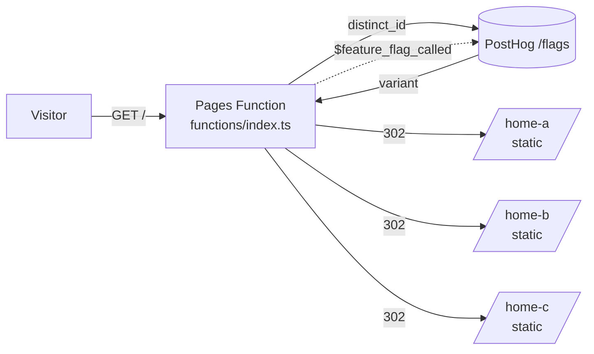

# Astro + PostHog server-side A/B/C redirect on Cloudflare Pages

A test app for running a PostHog A/B/C experiment on a fully static Astro site deployed to Cloudflare Pages. Visitors who land on `/` get assigned to a variant by PostHog in a Cloudflare Pages Function, then get redirected to one of three static home pages.



## How it works

Astro builds a plain static site into `dist/`. Cloudflare Pages serves it and runs `functions/index.ts` for `/` only. That function:

1. Reads or creates a PostHog distinct ID (the `ph_distinct_id` cookie, falling back to posthog-js's own cookie, then a new UUID). The cookie lasts 1 year.
2. Asks PostHog (`/flags?v=2`) for the experiment flag's variant, with a 1.5s timeout.
3. Sends a `$feature_flag_called` exposure event via `waitUntil`, so the redirect isn't delayed.
4. Redirects with a 302 to `/home-a`, `/home-b` or `/home-c`, keeping the query string. If PostHog fails, it redirects to `/home-a`.

`/home-a`, `/home-b` and `/home-c` are static HTML, and the function never runs for them. They load posthog-js with the same distinct ID, so pageviews and conversions are linked to the exposure. Each page shows `distinct_id · variant` at the bottom for debugging.

| Variant key in PostHog | Route |
| ---------------------- | ----- |
| `control` / `home-a`   | `/home-a` |
| `home-b`               | `/home-b` |
| `home-c`               | `/home-c` |

To change the mapping, edit `VARIANT_ROUTES` in `functions/index.ts`.

## Files

- `functions/index.ts`: Pages Function for `/` (flag lookup and redirect)
- `src/lib/posthog.ts`: small fetch-based PostHog client, shared with the layout
- `src/pages/home-{a,b,c}.astro`: static pages
- `src/pages/index.astro`: static fallback only; the function handles `/` on Pages
- `src/layouts/Layout.astro`: posthog-js init, bootstrapped with the function's distinct ID

## Configuration

| Variable | Value |
| -------- | ----- |
| `PUBLIC_POSTHOG_KEY` (required) | `phc_...` project API key |
| `PUBLIC_POSTHOG_HOST` | `https://us.i.posthog.com` (or `https://eu.i.posthog.com`) |
| `PUBLIC_POSTHOG_EXPERIMENT_FLAG` | `server-side-ab-test` |

The same variables are used in two places:
- **At build time**, by Astro, to inline the posthog-js settings into the static pages.
- **At runtime**, by the Pages Function.

On Cloudflare Pages, "Variables and secrets" (type **Text**) cover both uses. Locally, `.env` covers the build and `.dev.vars` covers the function.

## Local

```sh
npm install
cp .env.example .env && cp .env.example .dev.vars   # fill in the key in both
npm run preview      # builds, then runs Pages + Function at http://localhost:8788
```

`npm run dev` (plain `astro dev`) serves the static pages only. It does **not** run the Pages Function, so `/` won't redirect there. Use `npm run preview` to test the redirect.

## Deploy (Cloudflare Pages)

### 1. PostHog
Create an experiment with flag key `server-side-ab-test` and the variants `control`, `home-b` and `home-c`. Add a primary metric, then launch.

### 2. Cloudflare Pages project
Go to Workers & Pages → Create → **Pages** → Connect to Git, and pick this repo.

| Setting | Value |
| ------- | ----- |
| Framework preset | None (or Astro) |
| Build command | `npm run build` |
| Build output directory | `dist` |
| Root directory | *(empty)* |

Under **Settings → Variables and secrets**, add the 3 variables above as **Text** for Production (and Preview, if you use it). Pages picks up `functions/` automatically. Node 22 is pinned via `.node-version`.

After changing variables, redeploy (Deployments → Retry deployment) so the static pages are rebuilt with the new values.

### 3. Verify
```sh
curl -sI https://<project>.pages.dev/ | grep -iE "location|set-cookie"
# location: /home-b   set-cookie: ph_distinct_id=...
for i in $(seq 1 10); do curl -s -o /dev/null -w '%{redirect_url}\n' https://<project>.pages.dev/; done | sort | uniq -c
```
- Repeat visits with the same cookie should always land on the same variant.
- New visitors (incognito, or curl without cookies) should be spread across the variants.
- In PostHog, `$feature_flag_called` events should show up, and the experiment's exposures should increase.
