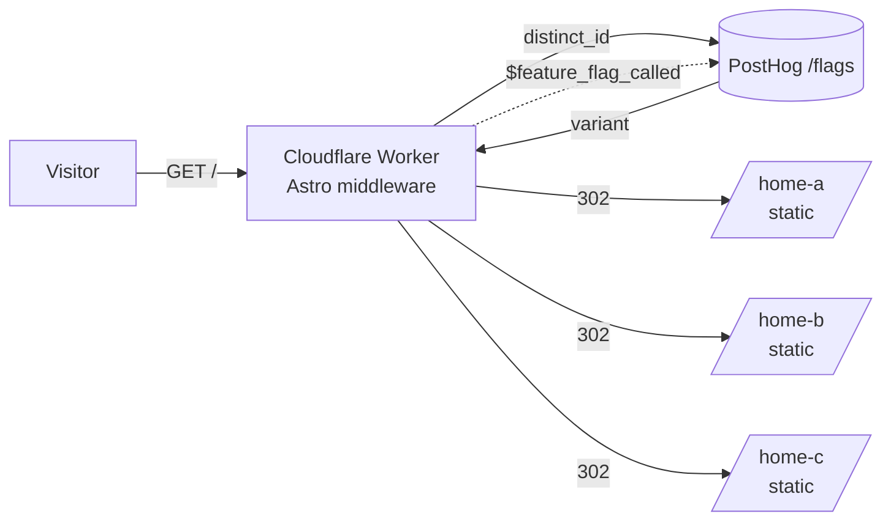

# Astro middleware + PostHog experiment redirect

A test app for running a PostHog A/B/C experiment on a mostly static Astro site deployed to Cloudflare. Visitors who land on `/` get assigned to a variant by PostHog in Astro middleware and are redirected to one of three static home pages.



## How it works

`/` is handled by Astro middleware running on a Cloudflare Worker. It:

1. Reads or creates a PostHog distinct ID (`ph_distinct_id` cookie, falling back to posthog-js's own cookie, then a new UUID).
2. Asks PostHog (`/flags?v=2`) for the experiment flag's variant.
3. Sends a `$feature_flag_called` exposure event (via `waitUntil`, so the redirect isn't delayed).
4. Redirects with a 302 to `/home-a`, `/home-b` or `/home-c` (query string kept). If PostHog fails or times out after 1.5s, it goes to `/home-a`.

`/home-a`, `/home-b` and `/home-c` are prerendered static HTML served straight from Cloudflare's asset store. The Worker never runs for them. They load posthog-js with the same distinct ID, so pageviews and conversions are linked to the exposure.

| Variant key in PostHog | Route    |
| ---------------------- | -------- |
| `control` / `home-a`   | `/home-a` |
| `home-b`               | `/home-b` |
| `home-c`               | `/home-c` |

Edit `VARIANT_ROUTES` in `src/middleware.ts` to change the mapping.

## Files

- `src/middleware.ts`: flag lookup and redirect (acts only on `/`)
- `src/lib/posthog.ts`: small fetch-based PostHog client (works in Workers)
- `src/pages/index.astro`: `prerender = false`, the only on-demand route
- `src/pages/home-{a,b,c}.astro`: static pages
- `src/layouts/Layout.astro`: posthog-js init bootstrapped with the middleware's distinct ID

## Configuration

| Variable | Example |
| -------- | ------- |
| `PUBLIC_POSTHOG_KEY` (required) | `phc_...` project API key |
| `PUBLIC_POSTHOG_HOST` | `https://us.i.posthog.com` (or `https://eu.i.posthog.com`) |
| `PUBLIC_POSTHOG_EXPERIMENT_FLAG` | `home-page-experiment` |

These values are read at **build time**. For local builds, copy `.env.example` to `.env`. On Cloudflare, set them as build variables.

## Local

```sh
npm install
npm run generate-types   # Cloudflare runtime types (git-ignored)
cp .env.example .env   # fill in the key
npm run dev            # middleware runs in workerd via the Cloudflare Vite plugin
npm run build && npx wrangler dev   # production-like preview
```

## Deploy

Note: `@astrojs/cloudflare` v14 deploys to **Cloudflare Workers with static assets**. This is Cloudflare's replacement for Pages, and it is still managed under "Workers & Pages" in the dashboard. Pages Functions are not used.

### 1. PostHog
1. Create an experiment (Experiments → New) with feature flag key `home-page-experiment`.
2. Add the variants `control`, `home-b` and `home-c`, and set the split (for example 34/33/33).
3. Pick a primary metric, such as a pageview or click on the home pages, then launch.

### 2. GitHub
```sh
git init && git add . && git commit -m "Astro middleware PostHog experiment"
gh repo create astro-middleware-test --private --source . --push
```

### 3. Cloudflare (Git-connected, auto-deploys on push)
1. Go to Dashboard → Workers & Pages → Create → **Import a repository** and pick the repo.
2. Build command: `npm run build`. Deploy command: `npx wrangler deploy`.
3. Under Settings → Build → **Build variables**, add `PUBLIC_POSTHOG_KEY`, `PUBLIC_POSTHOG_HOST` and `PUBLIC_POSTHOG_EXPERIMENT_FLAG`.
4. Deploy. The worker name comes from `wrangler.jsonc` (`astro-middleware-test-claude`), so the URL is `https://astro-middleware-test-claude.<subdomain>.workers.dev`.

### Alternative: deploy from CLI
```sh
npx wrangler login
npm run build && npx wrangler deploy
```

### 4. Verify
```sh
curl -sI https://<your-worker>.workers.dev/ | grep -iE "location|set-cookie"
# location: /home-b   set-cookie: ph_distinct_id=...
```
Repeat visits with the same cookie always land on the same variant. In PostHog, `$feature_flag_called` events should show up under the experiment.
